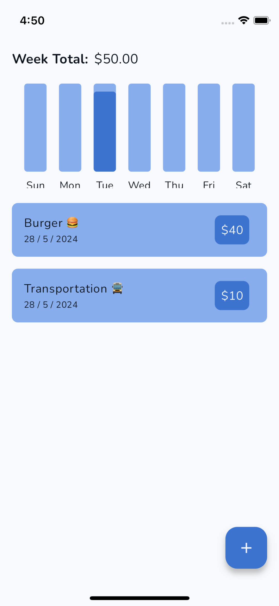
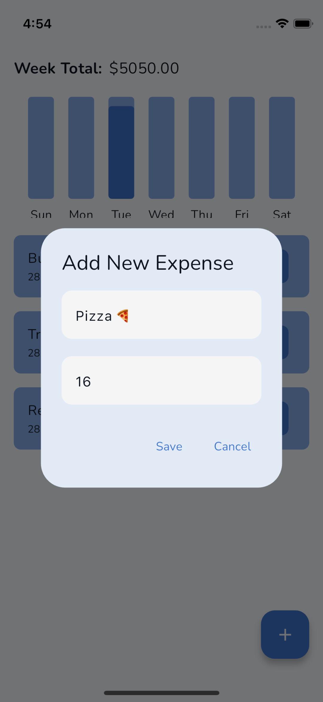
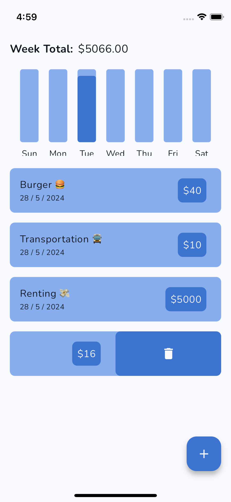

# Simple Budget - Flutter Application

Simple Budget is a user-friendly budget management application built using Flutter. It helps users track their income, expenses, and savings to better manage their finances. The app provides a simple and intuitive interface for managing personal budgets, viewing spending categories, and generating financial reports.

## Features

- **Simple Expense Management**: Easily add and delete daily expenses to keep track of your spending.
- **Daily Graphical Insights**: Monitor your weekly expenses with informative but simple graphs.

## Screenshots





## Getting Started

Follow these instructions to get a copy of the project up and running on your local machine for development and testing purposes.

### Prerequisites

- [Flutter SDK](https://flutter.dev/docs/get-started/install)
- [Dart SDK](https://dart.dev/get-dart)
- An IDE such as [Android Studio](https://developer.android.com/studio) or [VS Code](https://code.visualstudio.com/)

### Installation

1. **Clone the repository**

    ```bash
    git clone https://github.com/yourusername/simple_budget.git
    ```

2. **Navigate to the project directory**

    ```bash
    cd simple_budget
    ```

3. **Install dependencies**

    ```bash
    flutter pub get
    ```

### Running the App

1. **Run on an emulator or a connected device**

    ```bash
    flutter run
    ```

2. **Build APK for Android**

    ```bash
    flutter build apk
    ```

3. **Build for iOS**

    ```bash
    flutter build ios
    ```

   > Note: Building for iOS requires a macOS system with Xcode installed.

## Contributing

We welcome contributions to Simple Budget. To contribute:

1. Fork the repository.
2. Create a new branch (`git checkout -b feature/YourFeature`).
3. Make your changes and commit (`git commit -am 'Add some feature'`).
4. Push to the branch (`git push origin feature/YourFeature`).
5. Create a new Pull Request.

## License

This project is licensed under the MIT License - see the [LICENSE](LICENSE) file for details.

## Acknowledgements

- [Flutter](https://flutter.dev/) - The framework used for building this application.
- [Dart](https://dart.dev/) - The programming language used.
- All open-source libraries and tools that made this project possible.

## Contact

If you have any questions or feedback, feel free to reach out at [your-email@example.com](mailto:your-email@example.com).

---

Made with ❤️ by [Your Name](https://github.com/yourusername)
